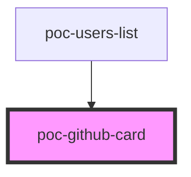

# github-card

<!-- Auto Generated Below -->

## Properties

| Property         | Attribute         | Description | Type     | Default     |
| ---------------- | ----------------- | ----------- | -------- | ----------- |
| `avatar`         | `avatar`          |             | `string` | `undefined` |
| `followersCount` | `followers-count` |             | `number` | `undefined` |
| `gistsCount`     | `gists-count`     |             | `number` | `undefined` |
| `name`           | `name`            |             | `string` | `undefined` |
| `repoCount`      | `repo-count`      |             | `number` | `undefined` |
| `username`       | `username`        |             | `string` | `undefined` |

## Dependencies

### Used by

 - [poc-users-list](../users-list)

### Graph

----------------------------------------------

*Built with [StencilJS](https://stenciljs.com/)*
